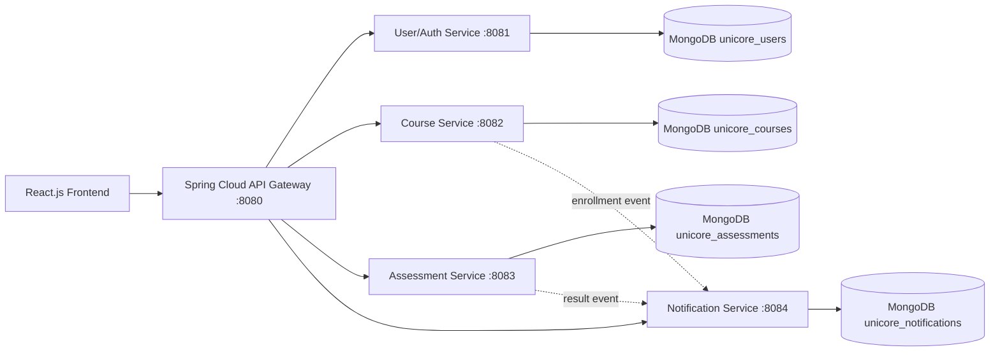

# UniCore LMS - Microservices-Based Learning Management System

UniCore LMS is a portfolio-ready full stack Learning Management System built with Java, Spring Boot, React.js, REST APIs, and MongoDB. It demonstrates independent microservices for authentication/users, courses, assessments, notifications, plus a Spring Cloud API Gateway and a role-based React frontend.

## Features

- JWT authentication with BCrypt password hashing
- Role-based access for `ADMIN`, `INSTRUCTOR`, and `STUDENT`
- Course catalog, search, course details, modules, lessons, and enrollment
- Instructor course creation and course ownership dashboards
- Quiz/assessment creation, MCQ submission, automatic scoring, result history
- Notification events for enrollment and assessment results
- Admin analytics for users, courses, enrollments, and scores
- Responsive React UI with dashboards, charts, cards, tables, loading/error states

## Architecture



## Tech Stack

- Backend: Java 17, Spring Boot 3, Spring Web, Spring Security, Spring Data MongoDB, Spring Cloud Gateway
- Frontend: React.js, React Router, Fetch API, Recharts, responsive CSS
- Database: MongoDB
- Security: JWT, BCrypt, CORS, validation, role-based authorization

## Folder Structure

```text
.
├── api-gateway/
├── user-service/
├── course-service/
├── assessment-service/
├── notification-service/
├── src/                  # React frontend
├── public/
├── pom.xml               # Maven multi-module parent
└── package.json
```

## Microservices

User/Auth Service owns registration, login, users, password hashing, and JWT creation.

Course Service owns courses, modules, lessons, search, instructor courses, enrollments, and progress.

Assessment Service owns quizzes, questions, submissions, automatic scoring, and result dashboards.

Notification Service stores notification events and read/unread state. Course and Assessment services call it through REST, keeping notification channels modular.

API Gateway routes frontend traffic:

- `/api/auth/**`, `/api/users/**` -> User Service
- `/api/courses/**` -> Course Service
- `/api/assessments/**`, `/api/results/**` -> Assessment Service
- `/api/notifications/**` -> Notification Service

## Main APIs

Auth:
- `POST /api/auth/register`
- `POST /api/auth/login`

Courses:
- `GET /api/courses`
- `GET /api/courses/{id}`
- `POST /api/courses`
- `PUT /api/courses/{id}`
- `DELETE /api/courses/{id}`
- `POST /api/courses/{id}/enroll`

Assessments:
- `GET /api/assessments`
- `POST /api/assessments`
- `POST /api/assessments/{id}/submit`
- `GET /api/results/student/{studentId}`

Notifications:
- `POST /api/notifications/events`
- `GET /api/notifications/user/{userId}`
- `PATCH /api/notifications/{id}/read`

## Environment Variables

Each service supports these defaults:

```bash
JWT_SECRET=unicore-development-secret-key-change-me-please-keep-long
MONGODB_URI=mongodb://localhost:27017/<service-db>
COURSE_SERVICE_URL=http://localhost:8082
NOTIFICATION_SERVICE_URL=http://localhost:8084
REACT_APP_API_URL=http://localhost:8080/api
```

Use the same `JWT_SECRET` for every backend service.

## Run Locally

Prerequisites: Java 17, Maven, Node.js, MongoDB.

```bash
mongod
mvn -DskipTests package
```

In separate terminals:

```bash
mvn -pl user-service spring-boot:run
mvn -pl course-service spring-boot:run
mvn -pl assessment-service spring-boot:run
mvn -pl notification-service spring-boot:run
mvn -pl api-gateway spring-boot:run
npm start
```

Open `http://localhost:3000`.

## Existing Code Reuse

The original project already had a React/Tailwind-style frontend foundation and Recharts dependency. The rebuild keeps React as the client technology, replaces the Supabase-specific auth/data flow with Spring Boot REST calls, and adds the requested Java microservices backend.

## Future Improvements

- Add Docker Compose for MongoDB and all services
- Add Swagger/OpenAPI docs per service
- Add email/SMS notification adapters
- Add integration tests with Testcontainers
- Add richer course editor flows for lessons and assessments
- Add CI for Maven and React builds

## Screenshots

Add screenshots of the landing page, course catalog, student dashboard, instructor dashboard, and admin analytics after running the app locally.
